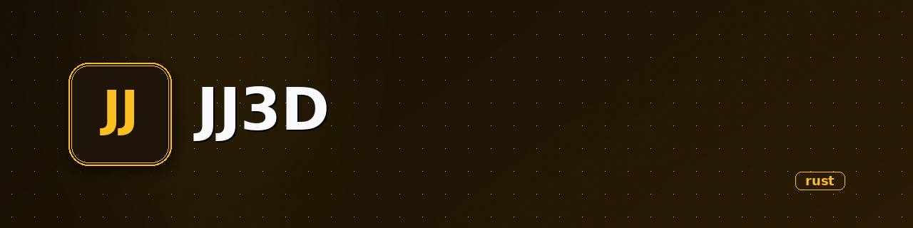

<p align="center">
  
</p>

<h1 align="center">JJ3D</h1>

<p align="center"><b>Weekly SDL2 graphics exercises across Go, Python, and Rust — from pixels to shape primitives.</b></p>

<p align="center">
  
  
  
  
  
  
</p>

---

## What it is

A collection of weekly exercises that explore 2D graphics programming with SDL2. Each week builds on the previous, starting from raw pixel manipulation and progressing to a trait-based shape system with Bresenham's line and circle algorithms. Week 1 includes implementations in Go, Python, and Rust; weeks 2–4 are Rust only.

**In one sentence:** Course exercises for learning raster graphics primitives by hand, not with a game engine.

## State

| | |
|---|---|
| **State** | experiment |
| **Last activity** | 2026-01 |
| **Usable today** | yes, for learning — run any `semana*` directory |
| **What's missing** | weeks 5+, no tests, no CI, no documentation beyond code |
| **Risks / known debt** | code duplication across weeks, TODOs in shape modules, no cross-platform build verification |

## Why it exists

Academic / personal coursework for learning how 2D rasterization works at the pixel level: Bresenham's line algorithm, circle drawing, polygon fill, and how to structure a small graphics library with traits and const generics.

## Demo

Each week opens an SDL2 window (200×200) and draws something:

- **Week 1** — fills the window with white pixels in a pattern
- **Week 2** — two diagonal lines sweeping across the screen at 60fps
- **Week 3** — static triangle and rectangle rendered from point arrays
- **Week 4** — animated circle (Bresenham) + rectangle using a `Shape` trait system

## Installation and usage

**Requirements:** SDL2 development libraries installed on your system.

```bash
# Ubuntu/Debian
sudo apt install libsdl2-dev

# macOS
brew install sdl2

# Arch
sudo pacman -S sdl2
```

### Week 1 — Go

```bash
cd semana1_go
go run .
```

### Week 1 — Python

```bash
cd semana1_python
pip install pysdl2
python main.py
```

### Weeks 1–4 — Rust

```bash
cd semana1_rust   # or semana2_rust, semana3_rust, semana4_rust
cargo run
```

## Stack

- **Languages:** Rust (primary), Go, Python
- **Graphics:** SDL2 via `sdl2` crate (Rust), `go-sdl2` (Go), `pysdl2` (Python)
- **Algorithms:** Bresenham's line, midpoint circle, const-generic polygon

## Architecture

Each week is a standalone Cargo/Go/Python project. The Rust weeks share a `core` module:

```
semana1_rust/src/main.rs          # pixel fill
semana2_rust/src/core/lines.rs    # Bresenham line
semana3_rust/src/core/shapes.rs   # polygon from points
semana4_rust/src/core/
  ├── shapes/
  │   ├── prelude.rs              # Shape trait
  │   ├── objects.rs              # ShapeObject (canvas, position, transform, rotation)
  │   ├── lines.rs                # CreateLine (Bresenham)
  │   ├── circles.rs              # Circle (midpoint algorithm)
  │   └── rects.rs                # Rect<N> (const-generic polygon)
  └── ...
```

## Repo structure

```
semana1_go/       # Go SDL2 pixel drawing
semana1_python/   # Python SDL2 line drawing
semana1_rust/     # Rust SDL2 pixel drawing
semana2_rust/     # Animated Bresenham lines
semana3_rust/     # Polygon shape drawing
semana4_rust/     # Shape trait system + circle
docs/             # Auto-generated overview
```

## Roadmap

- [ ] Weeks 5+ (3D projection, transforms, scene graph?)
- [ ] Fill algorithms (scanline, flood fill)
- [ ] Consolidate into a single crate with modules instead of per-week duplication
- [ ] Add tests for Bresenham / circle algorithms
- [ ] Cross-platform CI

## Notes and decisions

- **Const generics for polygons:** `Rect<'a, const N: usize>` lets the same struct hold triangles (N=3), quads (N=4), or arbitrary N-gons. Chosen over `Vec<Point>` to avoid heap allocation per frame.
- **Bresenham over SDL2's built-in lines:** manual implementation for learning, not because SDL2 can't draw lines.
- **Per-week duplication is intentional:** each week is a self-contained exercise. Refactoring into a shared crate would defeat the pedagogical purpose.
- **TODOs left in code:** `//TODO: Fabric?` (factory pattern for shapes), `//TODO: Make this into a structure helper` (line drawing as canvas method). These are noted but not addressed — the exercises are complete as-is.

## License

Private — no license file. Not open source.
